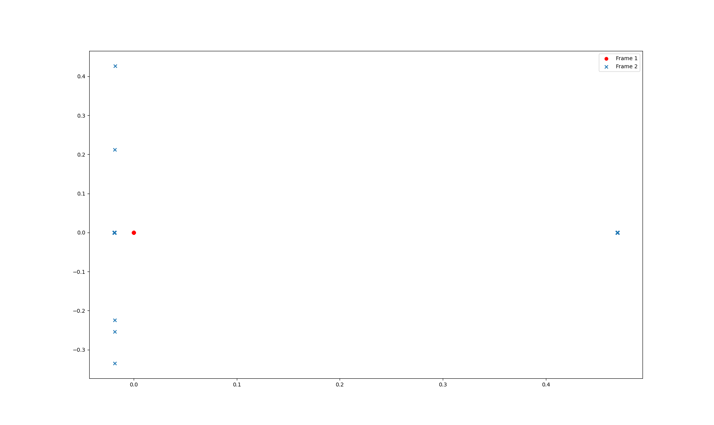
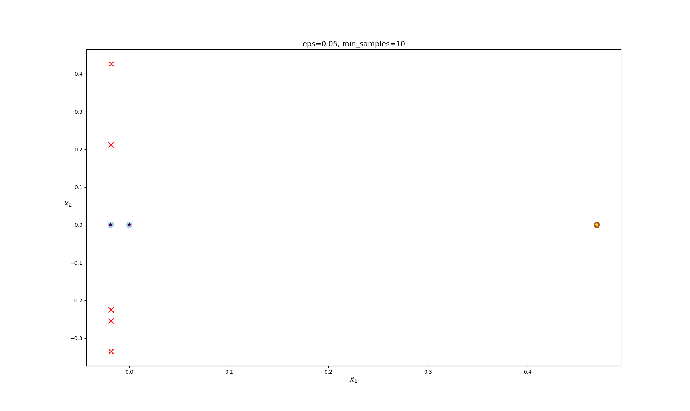

# cell_tracking_research


Research to track segmented 3d images of protein clusters.


### Results on Synthetic Sprites Dataset
Raw Sprites Dataset | Labeled Sprites Dataset
-------------------- | -----------------------
 | 

Full video in ./data

### Feature Embeddings Clustering
Sprites Dataset 2D Distribution| Protein Dataset 2D Distribution
-------------------- | -----------------------
 | 

Sprites Dataset Clustering | Protein Dataset Clustering
-------------------- | -----------------------
 |  

### Set Up Enviroment

To set up python3 virtual env.

```

/cell_tracking$ python3 -m venv env
/cell_tracking$ source env/bin/activate
/cell_tracking$ pip install -r requirements.txt 

```

### Generate Usable Data

This requires the original Segmentation_Results files from Yang.

```

/cell_tracking$ python3 data.py

```
Running this will generate a numpy dataset from the raw *.nii files. Will save in
/data folder. This is used by the tracker.

### Run Tracker

```

/cell_tracking/src/python$ python3 tracker.py

```

This will run tracking on the dataset and store the results in data/ as json files.
Uncomment functions in main() if doing it for the first time.

labled_tracks.pickle: Contains a python dict that holds the tracking results

tracks_frame.json: Json file where the key is the frame number and the value
is a list of every track in that frame.

tracks_pretty.json: Json file where the key is the cluster id and the value
is a list of all the frames that it appears in.


### Visualize Results

Run the Matlab script graph_results.m to label the 3D figs with the tracked ID's.
This uses the json tracking result files. 

Copy labled .fig results to cell_tracking_research/data/labled_frames

```

/cell_tracking_research$ cp ./data/raw_data/Segmentation_and_result/*/*_tracked.fig ./data/labled_frames/

```

Run demo.m or open demo.fig in /data to see tracking results, slide the slider the change frames.


